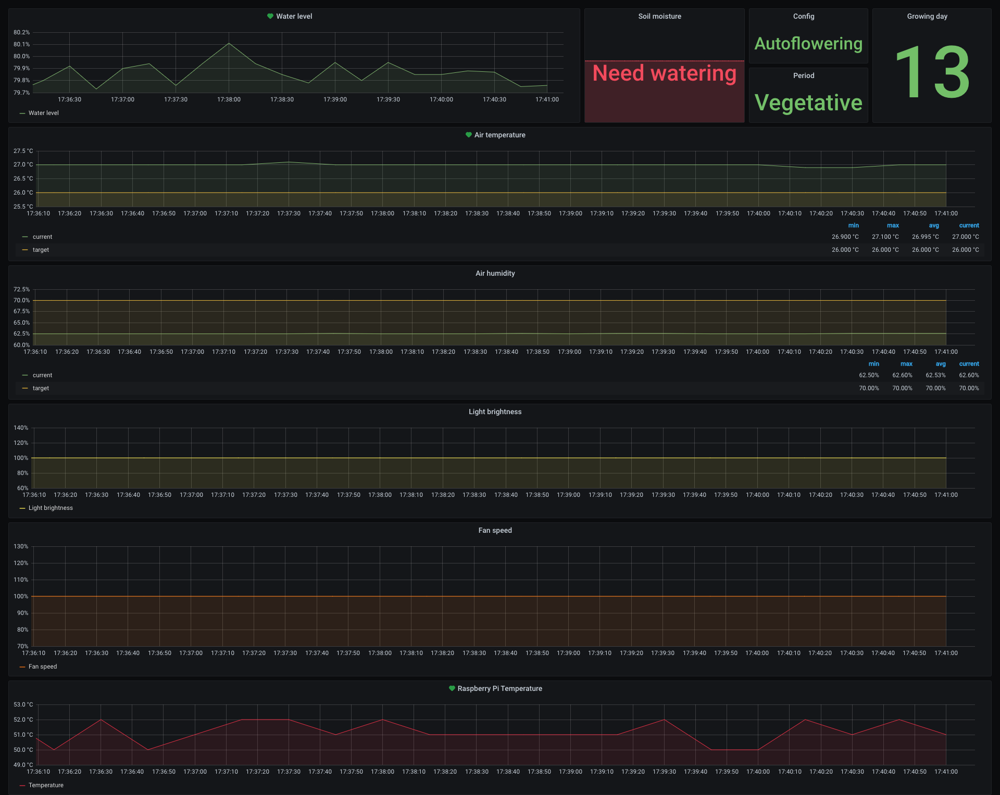

# WigwamOS

Software for automatize grooving process

## Functions

* temperature control (by FAN)
* humidity control (by humidifier)
* growing config management
* control light (day/night)
* soil moisture control (auto-watering)
* water level control (by ultra-sonic ranger)
* storage and display metrics graphs
* monitoring metrics & alerts into telegram channel about
* display stats on micro display by button click

### Supported Metrics

* Temperature
* Humidity
* Soil moisture
* Grow days
* Water level
* PI CPU temperature
* Light brightness
* Fan speed

#### Grafana Dashboard screenshot

## TODO
* LED dimmer for sunrise/sunset
* add button for show stats on display